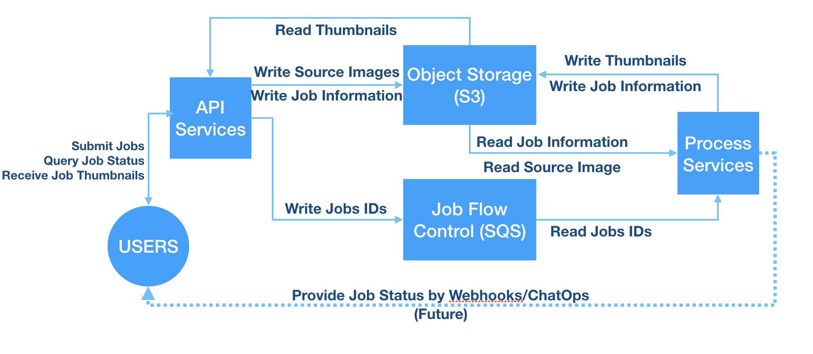

# Introduction
*This is a demonstration project made by Jason Ravencroft (jravey@gmail.com) for skills demonstration only.  It is absolutely not production ready.*

This service accepts an image and creates a 100x100 pixel thumbnail.

## Design
The service has four components, introduced in order-of-usage:
  1. An API service which accepts user requests, provides information on job status, and provides access to completed ouput.
  2. An SQS-compatible message queue (ElasticMQ)
  3. An S3-compatbile object storage service (Minio)
  4. A Thumbnailer service, which creates the thumbnail images

The API service is in the 'api' directory and contains a README file with service-specific details.
The Thumbnail service is in the 'thumbnail' directory and contains a README file with service-specific details.

The system is in a queue-based long-running job style.  Although individual jobs may be completed very quickly, a sudden increase in jobs would create a poor user experience.  For example, intermediate firewalls and load balancers may terminate connections if no traffic is present.  To avoid this, users submit a job to the API which is then enqueued and worked on a FIFO-basis by the Thumbnailer.  This provides the advantages of scalability on either side of the queue: more API service to accept more work, more Thumbnailer to work through the backlog.  From a cost-management perspective, this permits us to push down costs by working through the backlog with inexpensive computing resources such as EC2 Spot Instances. 

As of this writing, a g4dn.xlarge EC2 instance is $0.213 per hour for Spot Pricing and $0.71 for On-Demand pricing. For cost-sensitive customers, waiting until computational costs are reasonably low lets us pass the computations cost savings along to the customer.

### Job Information
Job information is expressed using Python dictionaries within the processes and as JSON between processes.  Job information is message format between the API and Thumbnailer.  As of this commit, the dictionary may have the following fields:

| Field     | Notes                                                          |
|-----------|----------------------------------------------------------------|
| id        | UUID of the job, assigned by the API when a new job is created |
| status    | One of 'pending', 'processing', 'complete', or 'failed'        |
| start     | Time of job creation                                           |
| finish    | Time of job completion or failure                              |
| location  | Location of status (when pending) or completed file (complete) |
| code      | HTTP-compatible status code                                    |
| message   | Human-friendly informational message                           |

*To minimize the chance of inconsistent data, the message queue job information contains only the job id.*

## Operational Diagram

1. Users interact only with the API on the left side.  The API service place job information and user-provided images into S3, then job the API service writes metadata into SQS for queueing and flow control.
1. The process services read the job IDs from SQS, then retrive the job document and related source image from S3.
1. The process services then write the thumbnails and updated job information into S3.
1. From here the API service can retrieve the thumbnails on behalf of users.
1. *In the future, job status transmission by webhooks or ChatOps (ie Slack, Teams) or pehaps PagerDuty*

## Usage
The system can be launched locally using Docker Compose.  The command is 'docker-compose up' and requires a local Docker engine to be present and running.  The command 'docker-compose up' will also build the containers if they are not present in your local repository.

In a production environment, it's likely one would use S3 or SQS directly.  In this case, update the environment varibles to match the SQS and S3 resources for your environment by copying and updating the Docker Compose file ('docker-compose.yaml') or by modifying the environment file ('service.env').  In such an environment, the services 'S3' and 'SQS' should removed from the Docker Compose file.

### Locally Run Discrete Components
The API and Thumbnailer service can be run outside of Docker while using the Docker-based SQS and S3.  To run these components, please do the following:
1. Create the virtual environment in the current directory: `virtual env -p $(which python3) env`
1. Activate the Python virtualenvironment: `. ./env/bin/activate`
1. Install the necessary packages: `pip install -f api/requirements.txt
1. Source the local environment file: `. ./localhost.env` 
1. Start the Thumbnailer: `python thumbnailer`
1. Start the API `python api`

## Testing
The testing uses pytest and should be run with the testing environment `. ./testing.env` enabled with the Docker containers running `docker-compose up`.  This environment creates easily-identifiable time-stamped Queues and Buckets.  It doesn't delete them yet.

The current state of testing  is focuses on the Storage module as that is the integration point for the API and Thumbnailer services.

I'd like to make tests which provide integration validation.  For example:
* Submit an image to the API, then validate the SQS message and S3 job information
* Write images to S3://input/ and SQS directly, then measure the Thumbnailer responses

Lastly, we should have tests which simulate the entire user experience from submission of images to checking status, to receiving the thumbnail.

### Storage
`pytest ./storage/tests/storage_test.py`

| Test                       | Purpose                                  |
|----------------------------|------------------------------------------|
| TestStorage::test_sqs      | Reads, Writes, Deletes SQS Messages      |
| TestStorage::test_s3_job   | Writes, Reads S3 Data, Compares Job Data |
| TestStorage::test_s3_image | Writes, Reads S3 Images                  |

### API
`pytest ./storage/tests/api_test.py`
*These tests are not yet written*

| Test                             | Purpose                          |
|----------------------------------|----------------------------------|
| TestApi::test_upload_image_text  | Validate 500 on submission       |
| TestApi::test_image_good         | Validate 202 on submission       |
| TestApi::test_job_pending        | Validate 200 on pending job      |
| TestApi::test_job_nonexisting    | Validate 404 on non-existent job |

### Thumbnailer
`pytest ./storage/tests/api_test.py`

| Test                             | Purpose                          |
|----------------------------------|----------------------------------|
| TestThumbnailer::test_image_bad  | Catch error on non-image data    |
| TestThumbnailer::test_image_good | Verify success of image data     |

# Issues
* The system is AWS-centric, this is a vendor lock-in problem.  Because we use S3- and SQS-compatible services, it's possible to run outside AWS but we lose the benefit of commodity queue and object storage services.
* The system has no authentication or authorization in-place.  It's unbillable in its current form.
* Any user can read any job by UUID, job owner should be verified before returning results.
* Application logging is local to the containers and lost when containers are destroyed.  This is addressable in at least two ways:
  * Internal emission of logs from within the containers.
  * Implement a Docker logging driver.
* The API and Thumbnailer services rely on a common 'Storage' module, it's manually managed between both products but should be deployed cleaning and accessed using an updated Python sys.path.
* The job information is a simple Python dictionary, an engineer could easily add functionality which may introduce unexpected behavior.  This should be a proper Python class is input validation of ease-of-use enhancements such as automatic UUID creation, start times, etc.
* The ElasticMQ (SQS) container needs operational adjustment as it runs out of heap space.  This may be a JVM tuning issue.
* A delay in S3 indexing could cause a job to written to S3 by the API, but not available to the Thumbnailer.  This would cause a message to fail because the S3 image is seemingly unavailable.

# Opportunities / Roadmap (In Order of Approximate Priority)
*This list is based on customer and business needs first, followed by operational enhancements, then convenience features.*
1. Implement authentication and authorization.
1. Formalize job information in a Python class.
1. Implement notification web hooks when creating a job.
1. Allow users to cancel jobs with `DELETE /jobs/{job_id}.
1. Change the job information records from S3 to a database enabling easy querying of historical data.
1. Emit logs for accountability and troubleshooting.
1. Change the job queue to a persistent database and rely on lightweight queries.  This will consolidate operational status and allow easy querying of active jobs.
1. Allow mulitple output sizes and formats, for example `"output": [ { "format": "png", "size": "100, 100", "format": "jpg", "size": "200,200" } ]`
1. Implement job prioritization, priority queueing, or as-available.
1. Remove old data and return 410 (Gone) on expired output
1. Protect against slow indexing in S3 by requiring a period of time to pass between the job's start time and the earliest possible failure.
